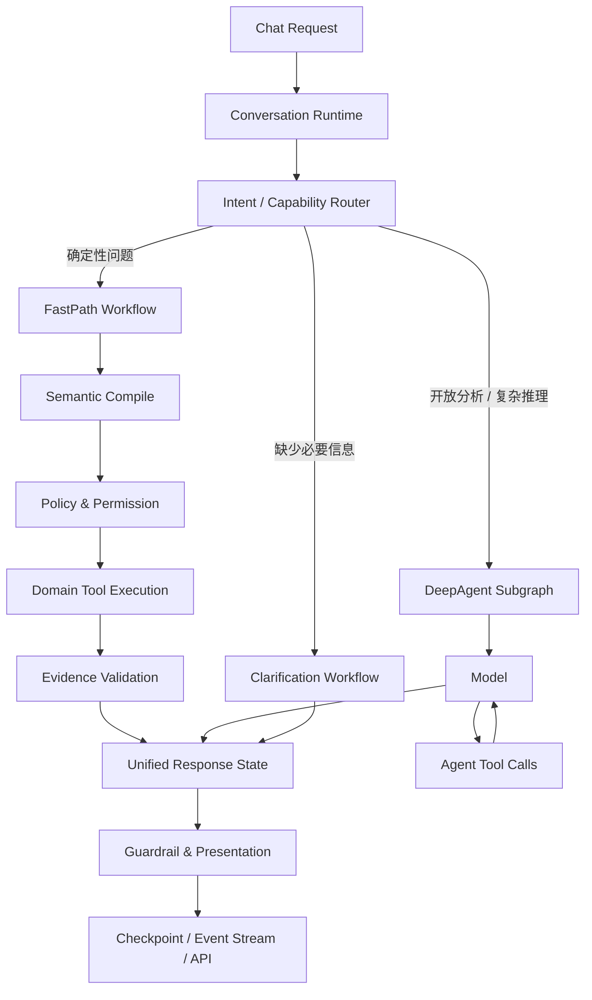

# Agent 运行时架构重构：顶层业务编排图（架构定稿）

> 定稿（2026-08-17）。用户拍板：**不应该把 FastPath 塞进 DeepAgent；应该把
> DeepAgent 和 FastPath 一起放进更高一级、统一可观测和有状态的业务编排图。**
> 本文件是实施蓝图：状态 schema、图拓扑、路由判定、fallback 状态机、
> Domain Tools 清单、LangSmith 结构、PR 拆分。实施以本文件为准。

## 0. 为什么重构（现状问题）

现状 Fast Path 是 `schedule_agent.chat()/iter_chat_sse()` 在 DeepAgent 之前
的**旁路短路**（`run_fast_path` 命中直接 return，`agent.invoke` 在 2063 才
发生）。导致：

1. **LangSmith trace 割裂**：Fast Path 是独立 root trace，一次请求看不到
   `router → fast_path → query → validate → response` 完整决策树。
2. **绕过状态模型**：checkpointer/messages/thread state/会话生命周期都没走
   统一入口——正是"新会话没落库""历史被覆盖"的根源。
3. **绕过横切能力**：Fast Path 的 evidence guardrail 硬编码 passed，与主链
   `apply_evidence_guardrail` 两套语义；权限/重试/异常/事件流在旁路重造。
4. **"Fast" 与 "图外" 无必然关系**：图内确定性节点同样快，且可追踪可治理。

## 1. 目标架构



## 2. 三层职责分离

### 2.1 Orchestration Layer（控制面）—— 顶层 LangGraph

- 会话与 thread 生命周期
- 意图与能力路由（`Intent / Capability Router`）
- FastPath / DeepAgent / Clarification 分支选择
- fallback 状态转换（显式状态机，禁止宽泛 except）
- checkpoint / streaming events / 统一异常语义
- LangSmith 根 trace

**它决定"走哪条执行路径"，但不直接实现指标查询。**

### 2.2 Capability Layer（执行能力）—— 强类型 Domain Tools

所有数据能力实现为强类型 Tools（两条路径共享）：

```
FastPath ──────┐
               ├── Domain Tools ── ERP / Metrics / DB
DeepAgent ─────┘
```

| Tool | 职责 | 现成实现 |
|---|---|---|
| `query_metric` | 白名单指标查询 | `workshop_metrics.query_metric` |
| `calculate_ranking` | 排行计算（Top-N/占比/集中度） | `app/runtime/calculation` + `finance_service.profit_report` |
| `resolve_time_range` | 相对时间→绝对区间+as_of | `app/runtime/resolver` |
| `inspect_result` | 按 result_id 读明细 | `analysis_result_store` |
| `validate_evidence` | 证据/计算/契约校验 | `app/runtime/structural_validator` + `contract_checker` |

差别只在调用方式：FastPath 由工作流**确定性调用**；DeepAgent 由模型**根据
上下文选择调用**。权限、租户隔离、参数校验和审计**必须在 Tool/Domain
Service 内**，不能只放在调用方。

### 2.3 Response Layer（统一输出面）

两个分支都写入同一个结构化 state（见 §3），API/SSE 只把最终 state 转换成
协议，不关心结果来自 FastPath 还是 DeepAgent。

## 3. 统一状态 schema

```python
class ConversationState(TypedDict, total=False):
    messages: Annotated[list[BaseMessage], add_messages]
    route: RouteDecision
    semantic_plan: SemanticPlan | None
    execution_result: ExecutionResult | None
    evidence: list[Evidence]
    presentation: Presentation | None
    trust_metrics: TrustMetrics | None
    failure: Failure | None
```

`RouteDecision` 是可审计对象（§5），`ExecutionResult` 承载 FastPath 的
VerifiedAssertion/Facts/Calculations，`failure` 携带稳定 reason_code + action
（不再用 except 混淆错误类型）。

## 4. FastPath 是确定性子图，不是大 Tool

FastPath 子图包含多个**独立可观测**的步骤：

```
route → compile → authorize → execute tools → validate evidence → construct response
```

每个步骤是图节点（LangSmith 可见、错误可分类、重试可按节点配置、指标可
分阶段统计）。**禁止**封装成一个 `fast_path_tool`——那会形成新黑盒（trace
只见一次 Tool 调用、每阶段错误无法分类、指标混在一起）。

核心业务逻辑是独立 Domain Service（`app/runtime/` 已有）；Tool 只是 Domain
Service 面向 Agent/Graph 的适配层。

## 5. Router 分层判定

Router 不需要证明问题"很复杂"，只需判断 **FastPath 是否可以安全执行**：

1. **硬规则 capability gating**：是否属于已注册、已验证的 FastPath 能力集合
   （`app/runtime/router.py` 的 FAST_PATH_METRICS + FAST_PATH_OPERATIONS）。
2. **结构化语义编译**：将问题编译成严格 schema（`semantic_compiler` /
   `parse_planner_json`），不直接执行自然语言猜测。
3. **置信度与完整性校验**：metric、dimension、time range、filters 必须满足
   执行要求（`validate_semantic_plan` + Resolver）。
4. **无法证明可确定执行时 → DeepAgent**。

Router 输出必须是可审计对象：

```python
RouteDecision(
    route="fast_path",
    capability="ranking.v1",
    confidence=1.0,
    reason_code="registered_plan_complete",
    plan=resolved_plan,
)
```

## 6. fallback 是显式状态机，不是异常捕获

```
NOT_APPLICABLE     → DeepAgent
LOW_CONFIDENCE     → DeepAgent
MISSING_SLOT       → Clarification
TRANSIENT_FAILURE  → Retry → DeepAgent（按能力配置）
PERMISSION_DENIED  → END / Reject
EVIDENCE_FAILED    → END / Fail Closed
SUCCESS            → Response
```

**禁止**宽泛的 `except Exception: run_agent()`——否则权限错误、数据完整性
错误和基础设施异常被混为一谈。当前 schedule_agent 里 `except Exception:
fast_path_observation = None`（1982 行）正是要移除的。

## 7. LangSmith 结构（单 root run）

```
conversation_run
├── route
├── fast_path
│   ├── semantic_compile
│   ├── permission_check
│   ├── query_metric
│   ├── calculate
│   └── evidence_validation
└── response_adapter
```

或：

```
conversation_run
├── route
├── deep_agent
│   ├── model
│   ├── tool
│   └── model
├── evidence_validation
└── response_adapter
```

统一记录：tenant_id、conversation_id、thread_id、route、capability、
semantic_plan_version、tool/result IDs、fallback_reason、model_calls、
latency、evidence_status。

## 8. 为什么不是 Middleware / 不是 Agent Tool

- **Middleware** 适合：tracing metadata、auth context、rate limiting、model
  call budget、PII、通用 guardrail、retry policy。**不适合**核心业务路由：
  业务路径在图定义中不可见、状态跳转依赖隐式 hook、测试难验证拓扑、多个
  middleware 顺序影响正确性、确定性流程多了会变成 middleware 条件分支堆积。
- **Agent Tool** 的问题：不再是零模型路径、路由结果不确定、latency/token
  更高、模型可能选错或不调用、Tool 成功后还需模型整理答案增加事实漂移。

> AI 工程化核心原则：**能由确定性程序可靠完成的决策，不交给生成模型；只有
> 不确定性和开放推理才交给 Agent。**

## 9. 实施 PR 拆分

| PR | 内容 | 边界（可独立验证） |
|---|---|---|
| **P0** | 顶层编排图骨架：`ConversationState`、`ConversationRuntime`（LangGraph）、RouteDecision 数据类、显式 fallback 状态机、Clarification 分支占位 | 图可跑通三类路由，state 正确流转；单测断言 fallback 映射 |
| **P1** | FastPath 子图：`semantic_compile → authorize → execute → validate → response` 五个节点，复用 `app/runtime/` 可信链与 Domain Tools | FastPath 问题端到端出 VerifiedAssertion + Presentation，LangSmith 见五个节点 |
| **P2** | DeepAgent 子图：`create_deep_agent` 作为子图节点（不再做根），Domain Tools 注入 | 开放问题走 model+tools，证据统一进 state |
| **P3** | 统一 Response/Guardrail/Evidence：两分支写同一 state，guardrail 一套语义，移除 Fast Path 硬编码 passed | 两路径输出结构一致，前端字段契约回归 |
| **P4** | checkpoint/streaming/API 适配：SSE 从 state 转换协议；移除 `run_fast_path` 旁路短路 | 新会话落库、历史不覆盖、SSE 全事件流一致 |
| **P5** | 清理：删 `fast_path_traced` 补丁、`_detect_filter_followup` 遗留、旧旁路分支；LangSmith 双结构验证脚本 | 全量测试 + `scripts/probe_*` |

## 10. 与现状代码的迁移映射

| 现状 | 去向 |
|---|---|
| `schedule_agent.chat()` 旁路 `run_fast_path` 短路 | 移除；统一走 `ConversationRuntime` |
| `app/runtime/` 可信链（contracts/resolver/router/validation/renderer） | **原样复用**，作为 FastPath 子图节点实现 |
| `workshop_metrics.query_metric` / `_metric_*` | 包装为强类型 Domain Tools（Capability Layer） |
| `_build_agent`（create_deep_agent） | 降级为 DeepAgent 子图节点（P2） |
| `apply_evidence_guardrail` | 保留为 Response Layer 唯一 guardrail（P3 统一） |
| `fast_path_traced`（agent_tracing.py） | P5 删除（图内天然有 trace） |
| `agent_trace_service` | 保留为本地账本，与 LangSmith 并存 |
| `semantic_compiler` | 复用为 Router 的结构化语义编译步（P0/P1） |

## 11. 验收标准

1. 一次请求 LangSmith 只有一个 root run，FastPath 分支见五个节点、DeepAgent
   分支见 model/tool 子节点。
2. 新会话落库、跨轮历史正确继承（不再覆盖），checkpoint 单一入口。
3. guardrail/evidence 一套语义；PERMISSION_DENIED/EVIDENCE_FAILED 显式失败，
   无宽泛 except→agent。
4. FastPath 命中零模型调用（trace 里无 model 节点）。
5. 全量测试通过；`scripts/probe_conversation_runtime.py` 验证三类路由与
   LangSmith 结构。
